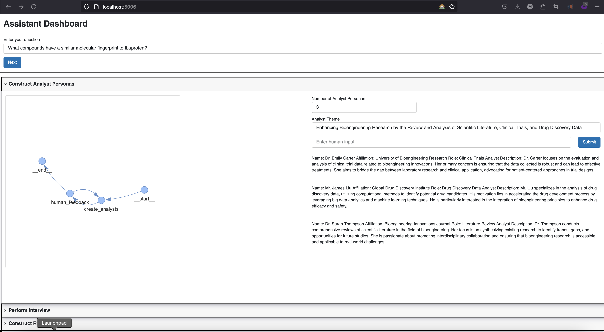
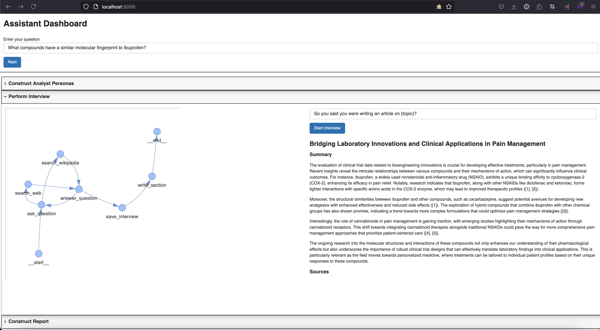
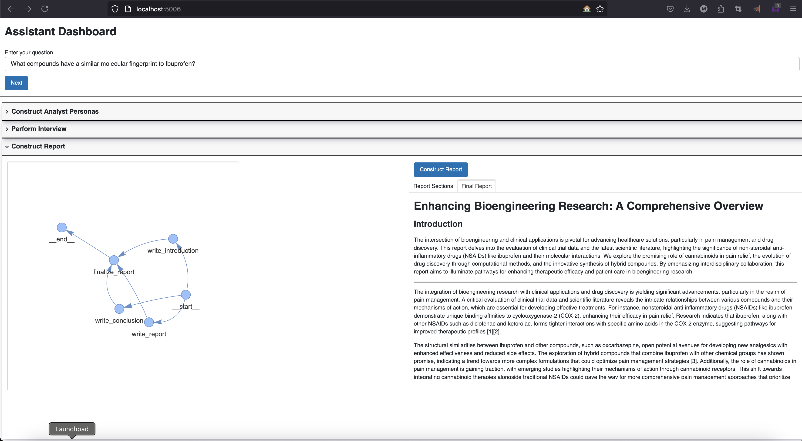

A demonstrator project for LangGraph/LangChain Agentic app. In current form it is using multiple graphs to:

- create AI Analyst Personas
- gather knowledge on the topic
- discuss the gathered knowledge with an AI Expert Persona
- prepare a Technical Report answering the topic

